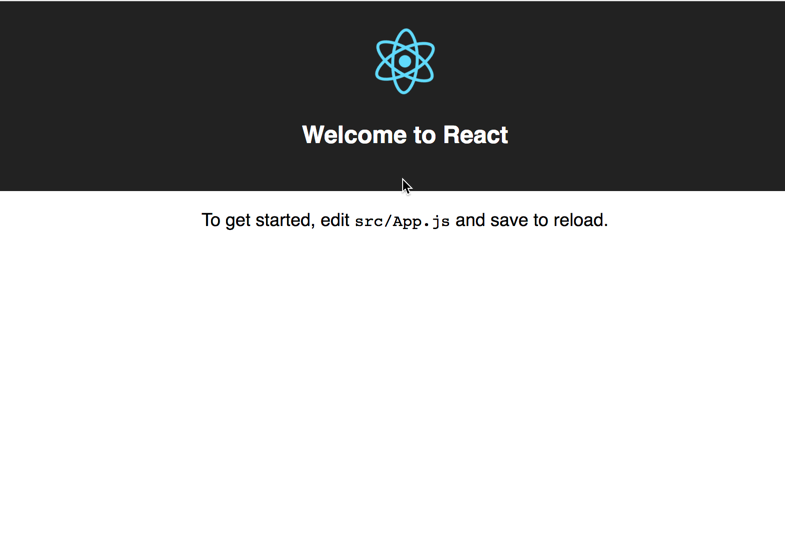
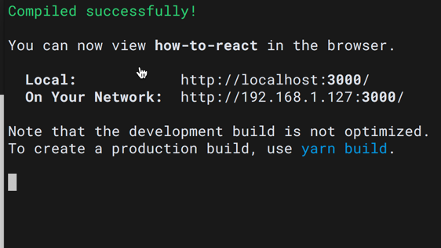
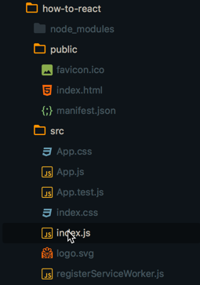
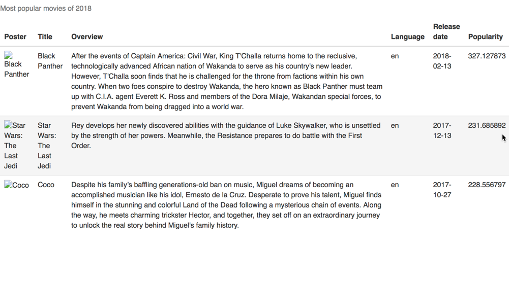
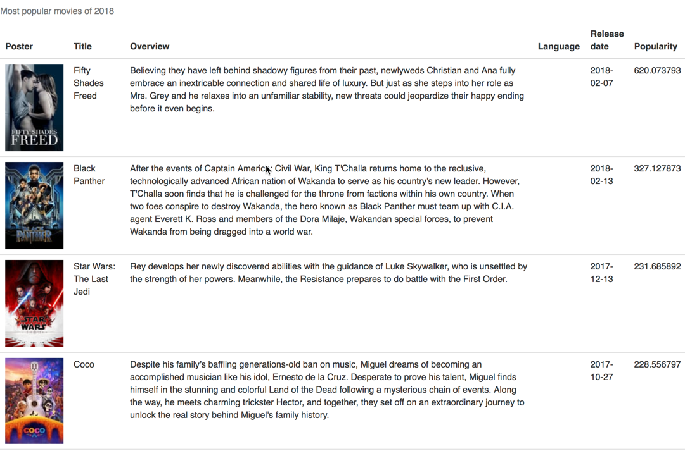
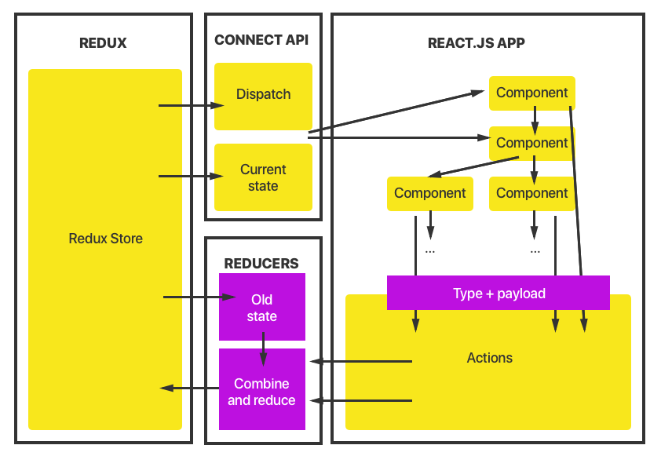

# How to React (.js)

## Outline 

### Aim
In this workshop, we'll go through a quick how-to guide to building a foundational framework for a _real, useful, production standard_ front-end app with and then fill it with real data.


### Learning outcomes
- Be able to create your first ``react.js`` app.
- Be able to store you app state using ``redux`` and integrate into your react app using ``react-redux``
- Be able to 'hydrate', or fill, your app state store with data from an external source like an API

### Pre-requisites
You must have an understanding of javascript and programming concepts such as:
- first-class functions
- ES6 ( arrow functions, object rest spread operators, classes, ``import`` & ``export`` in ``node.js``, promises, and decorators)

You must have these pacakges installed on your computer (preferably from Homebrew with write access):

- ``node``
- ``npm``
- ``yarn`` 

(You can install with ``brew update && brew install node yarn``!)

## Content

### Part 1 -- A simple react app

__This step can be found on branch ``create-app``__

Install ``create-react-app``, create an app, and run it:

- ``npm install -g create-react-app``
- ``mkdir ~/apps`` (change this to whatever you want)
- ``create-react-app [your-app-name]`` -- change ``[your-app-name]`` to whatever you want
- ``cd [your-app-name] && npm start``








### Part 2 -- dumb components with static data

__This step can be found on branch ``dumb-app``__

Now we'll create our app structure and fill it with our static data

- ``npm install bootstrap@3.3.0`` or ``yarn add bootstrap@3.3.0``
- copy ``bootstrap.css`` from ``node_modules/bootstrap/dist`` to ``public`` folder
- add ``<link rel="stylesheet" href="%PUBLIC_URL%/bootstrap.css">`` to ``<head>`` of ``public/index.html``
- create a folder ``components`` inside ``src`` and 2 folders inside ``Table`` and ``TableRow``
- create ``index.js`` files inside each one and create a basic react component inside

```
// library dependencies
import React, { Component } from 'react';

// component
class Table extends Component {
  render () {
    return null
  }
}

// module export
export default Table

```

- do the same for TableRow
- create a folder inside ``src`` called ``api``
- create a file called ``mock.js``. You can find the mock data on branch ``dumb-app`` in the ``src/api/`` folder

```
const Movies = [
  {
    poster_path: null,
    title: 'Black Panther',
    overview: 'After the events of Captain America: Civil War, King T\'Challa returns home to the reclusive, technologically advanced African nation of Wakanda to serve as his country\'s new leader. However, T\'Challa soon finds that he is challenged for the throne from factions within his own country. When two foes conspire to destroy Wakanda, the hero known as Black Panther must team up with C.I.A. agent Everett K. Ross and members of the Dora Milaje, Wakandan special forces, to prevent Wakanda from being dragged into a world war. ',
    language: 'en',
    release_date: '2018-02-13',
    popularity: 327.127873
  },
  ...
];

export default Movies;
```

#### Building up ``app.js``

- ``import Table from './components/Table'`` 
- Remove boilerplate code from ``render`` in app.js and render a ``<Table></Table>``
- remove ``null`` and add below to return statement in the render function for ``Table`` component:

```
(
  <table className="table table-hover">
    <caption>Most popular movies of 2018</caption>
      <thead>
        <tr>
          <th>Poster</th>
          <th>Title</th>
          <th>Overview</th>
          <th>Language</th>
          <th>Release date</th>
          <th>Popularity</th>
        </tr>
      </thead>
      <tbody>
        { this.props.children }
      </tbody>
  </table>
)
```

- ``import TableRow from './components/TableRow'``
- ``import Movies from './api/mock.js'``
- inside ``<Table>``:

```
{ Movies.map( el => { 
    return (
      <TableRow 
        key={el.title} 
        posterPath={el.poster_path}
        title={el.title}
        overview={el.overview}
        language={el.language}
        releaseDate={el.release_date}
        popularity={el.popularity}
      />
    )
  }) 
}
```

- replace null in render of ``<TableRow ... />`` with below:

```
return (
  <tr>
    <td></td>
    <td>{ this.props.title }</td>
    <td>{ this.props.overview }</td>
    <td>{ this.props.language }</td>
    <td>{ this.props.releaseDate }</td>
    <td>{ this.props.popularity }</td>
  <tr>
)
```




### Part 3 -- bringing in data

__This step can be found on branch ``api-driven-app``__


Put real data into your react app using ``axios``, a fully-featured and reliable http client. Take advantage of component state.

- ``npm add axios`` or ``yarn add axios`` 
- ``import Axios from 'axios';`` => ``App.js``
- add react lifecycle method and state to app.js:

```
constructor(props) {
  super(props);
  this.state = {
    movies: {},
    imageUrl: null,
    loading: true
  }
}

...

componentDidMount() {
  Axios.get('https://api.themoviedb.org/3/discover/movie?api_key=6f2b8b61c03afbeccc25962cf9ed8f5b&sort_by=popularity.desc&include_adult=false&include_video=false&page=1&year=2018')
  .then ( res => {
    this.setState({ movies: res.data.results })
  })
  .then ( () => {
    Axios.get(https://api.themoviedb.org/3/configuration?api_key=6f2b8b61c03afbeccc25962cf9ed8f5b)
    .then( res => {
      this.setState({ imageUrl: res.data.images.base_url + res.data.images.poster_sizes[0], loading: false })
    })
  })
  .catch ( err => ( return ));
}
```

- change references to ``Movies`` import as source of data, and extract the items from state before using them (see below) to ``movies`` eg ``movies['poster_path']. Except for ``poster_path`` should be ``imageUrl + movies['poster_path']``. Be sure to change the map function to the new API state too.
-- change render to conditionally load

``` 
render () {
  const { movies, imageUrl, loading } = this.state;
  if ( !loading ) {
    return (
      movies.map ( el = > {
          return (
            <TableRow
              posterPath = { imageUrl + el.poster_path }
              ...
            />
          )
        }
      )
    )
  }
  return (
    <div>LOADING...</div>
  )
}
```



### Part 4 -- adding redux and redux-logic

Next step is to remove API calls from components. Can be done in higher order components that are data driven, but prefer to remove business logic from components entirely. We need to introduce ``redux`` and ``redux-logic``




#### setting up redux infrastructure

- ``npm install redux redux-logic react-redux`` or ``yarn add redux redux-logic react-redux``
- create a new file called ``Redux.js`` in file root and add:

``` 
// library dependencies
import React, { Component } from 'react'
import { createStore, applyMiddleware } from 'redux';
import { createLogicMiddleware } from 'redux-logic';
import { Provider } from 'react-redux';

// component dependencies
import App from './App.js';

// root reducers and logic
import { default as rootReducer } from './RootReducer';
import { default as rootLogic } from './RootLogic';

const initialState = {
  Data: {
    movies: null,
    imageUrl: null
    loading: false,
    loaded: false,
    error: false
  }
}

const logicDependencies = {};

const configureStore = () => {
  const logicMiddleware = createLogicMiddleware(rootLogic, logicDependencies); // create logic middleware
  const middleware = applyMiddleware(logicMiddleware); // apply middleware to redux dispatch
  return createStore(rootReducer, initialState, middleware); // create the store
}

class Redux extends Component {
  constructor(props) {
    super(props);

    this.store = configureStore();
  }

  render() {
    return (
      <Provider store={this.store}>
        <App />
      </Provider>
    )
  }
}

export default Redux;
```

- create a new file called ``App.reducer.js``. Contents:

```
// initial state
const initialState = {
}

export default function appReducer(state = initialState, action) {
  switch( action.type ) {
    case 'GET_MOVIES': {
      return {
        ...state,
        loading: true
      }
    }
    case 'GET_MOVIES_SUCCESS': {
      return {
        ...state,
        loaded: true,
        loading: false,
        movies: action.payload.movies,
        imageUrl: action.payload.imageUrl,
        error: false
      }
    }
    case 'GET_MOVIES_FAIL': {
      return {
        ...state,
        loaded: false,
        loading: false,
        error: true
      }
    }
    default: {
      return state
    }
  }
}
```

- create a new file called ``App.logic.js``. Contents:

```
// library dependencies
import { createLogic } from 'redux-logic';
import Axios from 'axios';

export const getMoviesLogic = createLogic(
  {
    type: 'GET_MOVIES',
    validate: ({ action }, allow, reject) => { // always goes through to reducer
      if ( action.type !== 'GET_MOVIES' ) {
        reject();
      }
      allow(action);
    },
    process: ({ action }, dispatch, done) => { // side effects of action
      Axios.all([
        Axios.get('https://api.themoviedb.org/3/discover/movie?api_key=6f2b8b61c03afbeccc25962cf9ed8f5b&sort_by=popularity.desc&include_adult=false&include_video=false&page=1&year=2018'),
        Axios.get('https://api.themoviedb.org/3/configuration?api_key=6f2b8b61c03afbeccc25962cf9ed8f5b')
      ])
      .then( Axios.spread( (movies, config) => {
        dispatch({
          type: 'GET_MOVIES_SUCCESS',
          payload: { movies: movies.data.results, imageUrl: config.data.images.base_url + config.data.images.poster_sizes[0]}
        });
      }))
      .catch( err => {
        dispatch({
          type: 'GET_MOVIES_FAIL',
          payload: err.message,
          err: true
        });
      })
    }
  }
)

export default [
  getMoviesLogic
]
```

- create a new file called ``RootReducer.js``. Contents: 

```
// redux
import { combineReducers } from 'redux'; 

// import all your app reducers here
import AppReducer from './App.reducer.js';

export default combineReducers({
  'Data': AppReducer
}); 

```

- create a new file called ``RootLogic.js``. Contents:

```
import { default as AppLogic } from './App.logic.js';

// export the array of logics here. actions will be passed to each in order
export default [
  ...AppLogic
];
```

#### integrating redux

- remove ``componentDidMount`` from ``<App />`` component.
- remove state set up in ``consructor`` too.
- add the following to ``App.js``:

```
import { connect } from 'react-redux';

// other imports


... // after component declaration
export default connect(state => ({ Data: state.Data }), dispatch => ({ dispatch: dispatch }))(App);

```

- add a ``loadData`` method to component:


```
constructor(props) {
  ...
  this.loadData = this.loadData.bind(this);
}

...


loadData(){
  dispatch({ type: 'GET_MOVIES' });
}

...

```

- add a button to trigger the loading of the data to render, and add conditional rendering so table is loaded only once data has arrived

```
...

render() {
  const { loading, loaded, error, movies, imageUrl } = this.props.Data;
  if ( !loaded && !loading && !error ) {
	  return (
	    <button onClick={ this.loadData }>
	    Click me to load some movies!
	    </button>
	  )
	} else if ( !loaded && loading && !error ) {
	  return (
	    <div>LOADING</div>
	  )
	} else if ( !loaded && !loading && error ) {
	  return (
	      <div>ERROR! ERROR! ERROR!</div>
	  )
	} else if ( loaded && !loading && !error ) {
    return (
      <Table>
        {
          movies.map ( el => {
            ...
          })
        }
      </ Table>
    )
  }
}
```

- replace import of ``App`` in ``index.js`` with ``Redux`` and make sure initial React binding is to Redux component:

```
```

- remove ``Axios`` import from ``app.js`` -- it's now redundant


